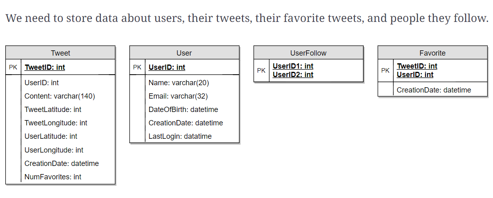
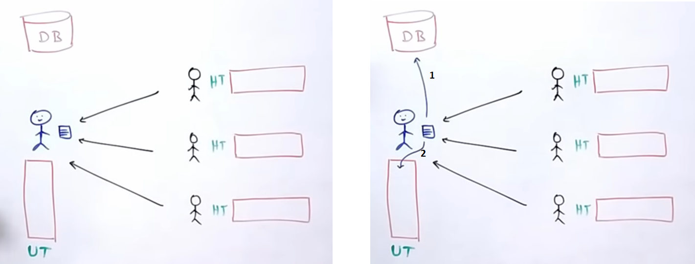
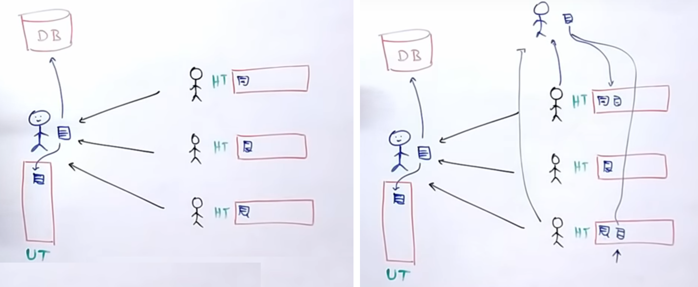
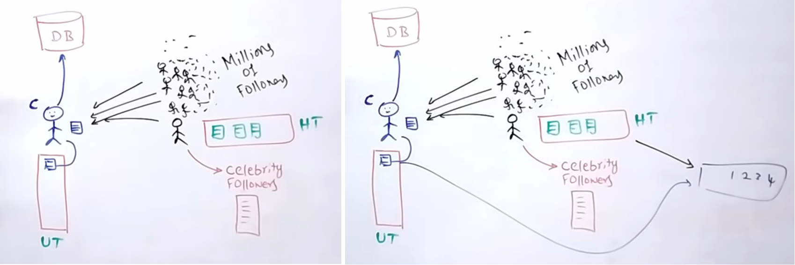
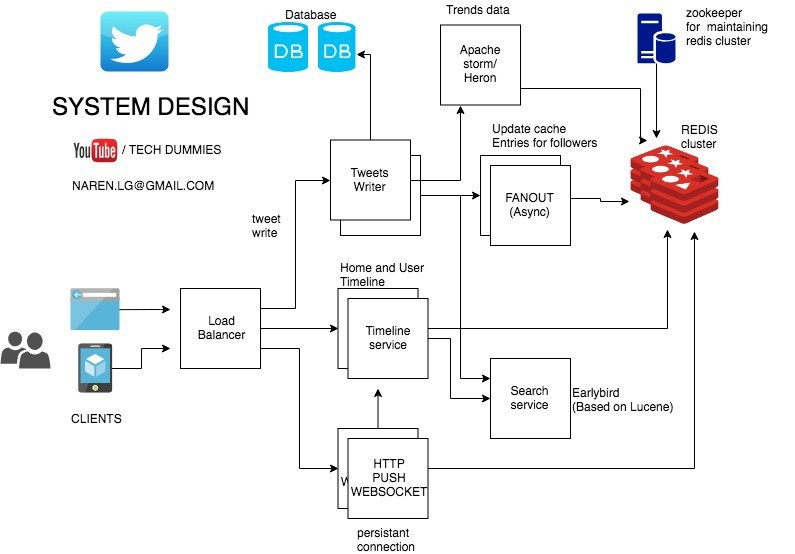

# twitter-system-design
System Design for Twitter

Have a look at the Requirements :
# Functional Requirement

- User onboarding : Account management
- Tweet : Tweet, Re-tweet, Follow
- Timeline display : User's Timeline, Home Timeline
- Trends display
- Recommendation
- Search and build search timeline.

It is really a breadth system design. We will focus on one of the functionality.

# Non Functional Requirements
- Read Heavy System
- Fast Rendering.
- High Scalability required.
- Ok to have eventual consistency.

# Basic Design and Database

# Timeline Display
## The first solution
User's timeline : Select all tweets from tweet table where userid is the queried userid. Include the retweets.

Home Timeline : Select all tweets from tweet table where userid belongs to the list of users followed by the queried user.

Easy enough to say and super easy to do.
Well yes, if you have users count falling under 1000s. But look at users sample activity as per current usage on twitter:

- Twitter boasts 330 million monthly active users (as of 2019 Q1). Of these, more than 40 percent, or more specifically, 145 million, use the service on a daily basis (Twitter, 2019). 
- Half a billion tweets are sent out each day (Mention, 2018). That equates to 5,787 tweets per second.

It is not possible to query database everytime a user see its home page considering this volume.

Solution : Design better way to read timeline from Cache. We need lot of cache.

## The Second solution
Solution is a write based fanout approach. Do a lot of processing when tweets arrive to figure out where tweets should go and precompute timelines for every active user and store it in the cache, so when the user accesses the home timeline, all you need to do is just get the timeline and show it.

A simple flow of tweet looks like,

User A Tweeted

Through Load Balancer tweet will flow into back-end servers

Server node will save tweet in DB/cache

Server node will fetch all the users that follow User A from the cache

Server node will inject this tweet into in-memory timelines of his followers

Eventually, all followers of User A will see the tweet of User A in their timeline

BUT does it work always? is it efficient?

Handle celebrity users: A user with millions of follower.

User A timeline : Merge following timelines:

- User A timeline from Cache.
- Recent tweets from celebrity followed by user A
- Ad/Promoted tweeds from Ad services.

Handle Online Users:
- Online users are handled exactly in whatsapp way of messaging them.
- A live websocket connection will be available and that will handle the tweet injection for the online users.
- This happens through the User Live Websocket service. This service keeps an open connection with all the live users, and whenever an event occurs that a live user needs to be notified of, it happens through this service. Now based on the user’s interaction with this service we can also track for how long the users are online, and when the interaction stops we can conclude that the user is not live anymore. When the user goes offline, through the websocket service an event will be fired to Kafka which will further interact with user service and save the last active time of the user in Redis, and other systems can use this information to accordingly modify their behavior.

Cache storage looks like this:

user_id : [t1,t2,t3,.....tn] User's timeline

user_id : [t1,t2,t3,.....tn] Home timeline

user_id : [u1,u2,u3...un] list of followed users

user_id : [u1, u2,...un] list of celebrity in follower list

## Timeline Services done in main memory
 

# Design flow

If we follow this appraoch to have timeline stored in Cache, this makes our Cache management critical. 
Improvements:

- Don’t compute timeline for inactive users who don’t log in to the system for more than 15 days (random number)
- Keep timeline storage for normal user upto 3-4 days(again a random number)

# Recent changes in timeline display

Timeline display algorithm has been changing at twitter frequently. As per one of the twitter blog , it may change as frequent as on weekly basis. The basic approach for sorting the tweets in chronological order has gone behind the curtain, it did not disappear but its on backfoot. The tweets will go through the ranking algo for a specifica users considering the relevence for that user. So you may see the tweets not necessarily in the chronological order like old days(till year 2014 ).

# How Trends / Trending topics are calculated?

Getting 5000 tweets in a minute is an example of twitter trend.

Covered in the trending algorithm. 
# How twitter perform a search and builds a search timeline

Search timeline : a different topic, different time.

# Analytics of tweets

Twitter uses Hadoop as analytics tool.

# References
https://www.codekarle.com/system-design/Twitter-system-design.html

https://medium.com/@narengowda/system-design-for-twitter-e737284afc95

https://blog.twitter.com/engineering/en_us/topics/infrastructure/2017/the-infrastructure-behind-twitter-scale.html

https://blogs.ischool.berkeley.edu/i290-abdt-s12/

http://highscalability.com/blog/2013/7/8/the-architecture-twitter-uses-to-deal-with-150m-active-users.html

